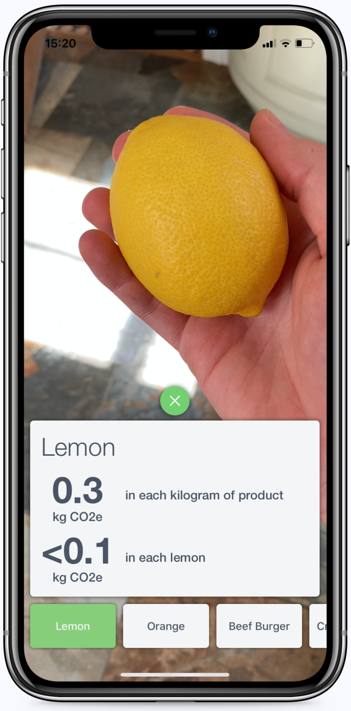
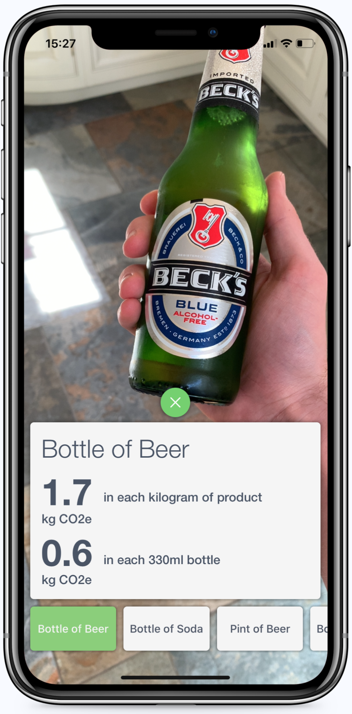

# CarbonCamera
### The carbon footprint camera app for iPhone
CarbonCamera is an iOS app which shows the carbon footprint of food or drinks, detected in a photo using the ResNet50 neural network.

Take a photo of your snack or meal and compare its carbon emissions to other suggested foods.

 

### ☘️ App features ☘️

* Custom camera interface integrated into the app, cut down to only include the required features (rear-camera & flash control) and provide an easier-to-use app
* Food and drinks in captured photos are classified using a pretrained version of the ResNet50 neural network, implemented using Apple's Core ML library
* Carbon footprint information for identified food is displayed to a user in a pop-up
* A custom UIView pop-up box is used to display said information, in order to be tightly integrated into the app and consistant with the design, whilst still in-keeping with Apple design standards
* Other foods are suggested which are similar to a photographed food, created programmatically when a photo is taken

---

Developed by James Bungay in July 2020, as a combination of my interest in software development and environmental issues.
